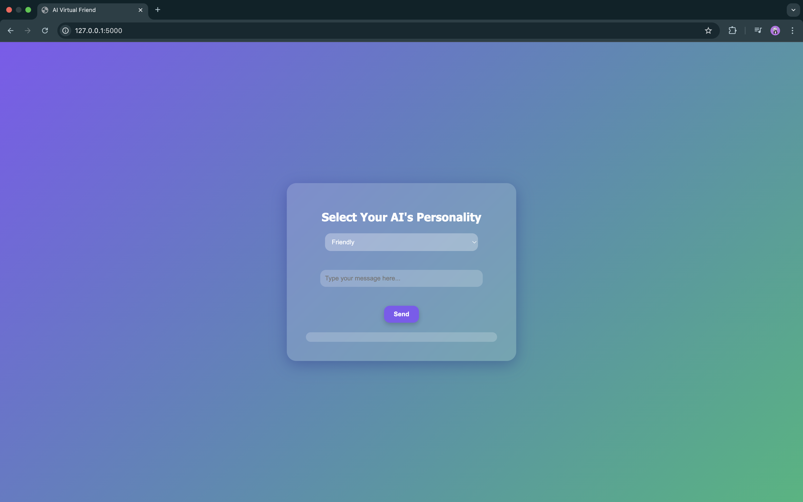

# AI Virtual Friend (Mood & Personality Chat App) 

This is a small and fun project I built to explore how AI personalities can change the way we interact with chat applications.
You can pick whether you want your AI to be Friendly, Sarcastic, or Professional — and it’ll reply accordingly. It’s a simple rule-based app, but gives a cool demo of mood analysis too.

##  Technologies Used:
- HTML / CSS / JS
- Python Flask
- AI Engine (Rule-based)
- Beautiful UI with Gradient Background

##  Features:
- Select AI Personality
- Dynamic Mood-Based Response
- Clean & Modern UI
- Built with Flask + Vanilla JS

##  How to Run:
1. Clone this repo
2. Create virtual environment:

##  Project Preview:

